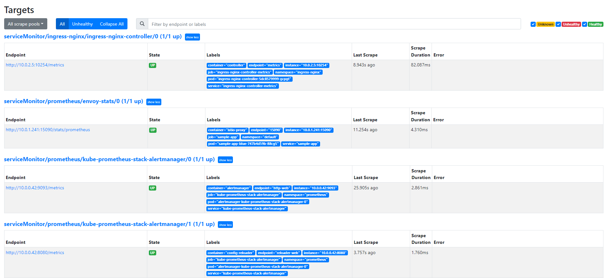
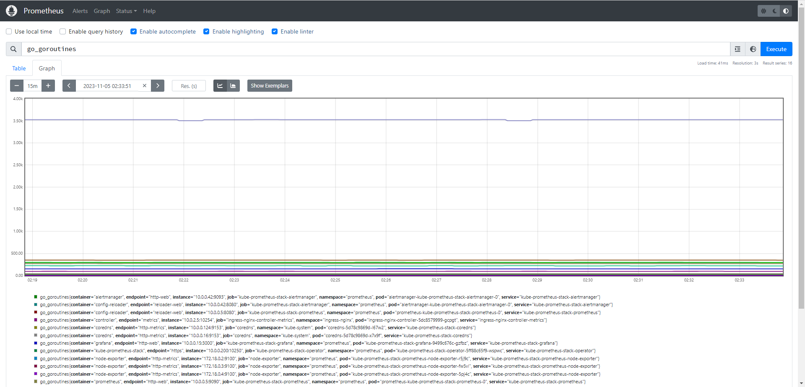

# chapter02_prometheus

この章では、Kubernetes上での様々なメトリクスの基盤としてPrometheusを紹介し、実際に導入してみます。

## Prometheusについて

TODO

## PromQLについて

TODO

## Prometheus Operatorについて

TODO

## 実践: kube-prometheus-stackのインストール

KubernetesクラスタにPrometheusをインストールする方法として、
Prometheusおよび各種ExporterをDaemonset等でデプロイする方法もありますが、
ここではkube-prometheus-stackというHelm Chartを利用したいと思います。

kube-prometheus-stackでは以下のようなコンポーネントをまとめてインストールすることができ、
各種設定もvalues.yamlで宣言的におこなうことができるため、導入/管理が比較的かんたんに実現できます。

- Prometheus
- Grafana
- AlertManager
- kube-state-metrics
- Node Exporter
- Prometheus Operator

導入のために、以下のようなhelmfileを用意します。

```yaml
# helmfile.yaml

repositories:
  - name: prometheus-community
    url: https://prometheus-community.github.io/helm-charts

releases:
  - name: kube-prometheus-stack
    namespace: prometheus
    createNamespace: true
    chart: prometheus-community/kube-prometheus-stack
    version: 50.3.1
    values:
      - values.yaml
```

また、values.yamlを以下のように指定します。

```yaml
# values.yaml

grafana:
  adminUser: admin
  adminPassword: handson_saiko!
```

実際に各種サービスが起動しているか確認してみましょう。

```bash
$ helmfile sync
$ kubectl get pods -n prometheus
alertmanager-kube-prometheus-stack-alertmanager-0           2/2     Running   0          92s
kube-prometheus-stack-grafana-5f4bf8df47-5csmk              3/3     Running   0          100s
kube-prometheus-stack-kube-state-metrics-776cff966c-x4v7w   1/1     Running   0          100s
kube-prometheus-stack-operator-fdc594c4d-6896k              1/1     Running   0          100s
kube-prometheus-stack-prometheus-node-exporter-7972j        1/1     Running   0          100s
kube-prometheus-stack-prometheus-node-exporter-dbkqx        1/1     Running   0          100s
kube-prometheus-stack-prometheus-node-exporter-jqk58        1/1     Running   0          100s
kube-prometheus-stack-prometheus-node-exporter-tm89f        1/1     Running   0          100s
prometheus-kube-prometheus-stack-prometheus-0               2/2     Running   0          92s
```

### Ingressによるサービスの公開

続いて、PrometheusやGrafana等の各UIをIngressで公開していきます。
すでにingress-nginxがデプロイされていると思うので、以下のような設定でIngressをデプロイして公開します。
ここで、仮のドメインとして `example.com` を使用します。
このドメインには、 `/etc/hosts` (Windowsの場合 `C:\Windows\System32\drivers\etc\hosts`) を編集してアクセスします。

```yaml
---
apiVersion: networking.k8s.io/v1
kind: Ingress
metadata:
  name: grafana-ingress-by-nginx
  namespace: prometheus
  annotations:
    nginx.ingress.kubernetes.io/ssl-redirect: "false"
spec:
  ingressClassName: nginx
  rules:
    - host: grafana.example.com
      http:
        paths:
          - path: /
            pathType: Prefix
            backend:
              service:
                name: kube-prometheus-stack-grafana
                port:
                  number: 80

---
apiVersion: networking.k8s.io/v1
kind: Ingress
metadata:
  name: prometheus-ingress-by-nginx
  namespace: prometheus
  annotations:
    nginx.ingress.kubernetes.io/ssl-redirect: "false"
spec:
  ingressClassName: nginx
  rules:
    - host: prometheus.example.com
      http:
        paths:
          - path: /
            pathType: Prefix
            backend:
              service:
                name: kube-prometheus-stack-prometheus
                port:
                  number: 9090
```

```bash
$ kubectl apply -f ingress.yaml
```

実際にそれぞれのUIが公開されているか確認してみましょう。
hostsファイルを書き換えた状態で、ブラウザで `prometheus.example.com/grafana.example.com` にアクセスしてみてください。

Grafanaの管理者がvalues.yamlに記載した認証情報でログインできなかった場合は、
以下のコマンドを実行してパスワードを確認し、ログインしてください ( デフォルトでは `prom-operator` になっているはずです)

```bash
kubectl get secrets -n prometheus kube-prometheus-stack-grafana -o json | jq -r .data[\"admin-password\"] | base64 -d
```

## 実践: Prometheus Web UIを触ってみよう

### Alerts

kube-prometheus-stackでデフォルトで導入されているアラートルールを確認することができます。


### Status

現在稼働しているPrometheusの状態確認がおこなえます。
以下のスクリーンショットでは、scrape_configに設定されたexporterに対するスクレイプが正しくおこなえているかどうか等の情報が表示されています。



### PromQL

Prometheus Web UIでは、PromQLを利用してインタラクティブに簡単なモニタリングをおこなうことができます。
ここではkube-prometheus-stackがデフォルトでインストールするExporterの様子を掴むために、
実際にPromQLを使ってメトリクスを見てみましょう。
PromQLの詳細な仕様についてはこちらを御覧ください。

> https://prometheus.io/docs/prometheus/latest/querying/basics/

`prometheus.example.com` にアクセスして、PromQL入力欄に `go_goroutines` と入力してみます。



これは、Go言語で実装されたExporterでよく公開されている、現在のgoroutineの発行数となるメトリックです。
これはGaugeとなっているので、単調増加ではなく微妙に増減しているのが確認できます。
後ほど、いくつかのPromQL実践例を紹介します。

### クリーンアップ方法

Ingressを削除する

```zsh
$ kubectl delete -f ingress.yaml
```

kube-prometheus-stackのアンインストール

```zsh
$ helmfile destroy
```

## ユースケース別Prometheus Operatorの使い方

TODO

## PromQLチートシート

TODO
