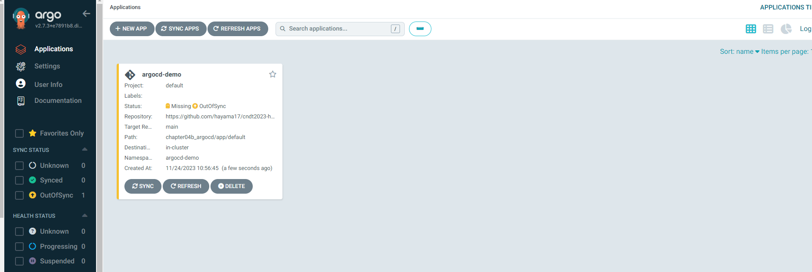
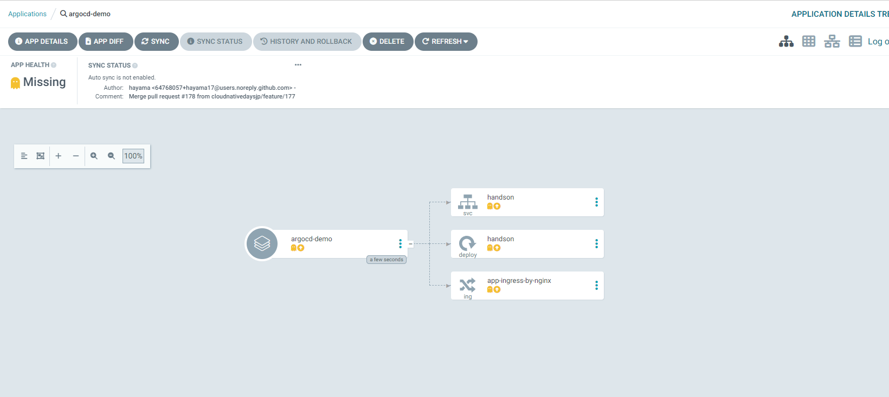
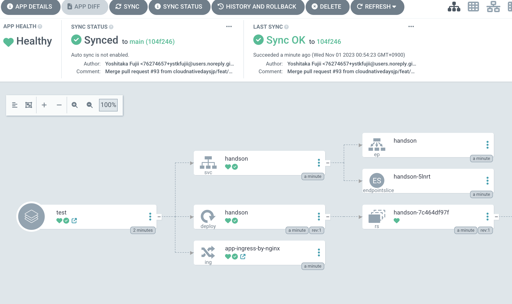

# chapter04b_argocd
この章では、Kubernetes上でGitOpsを可能とするCDツールであるArgo CDについて紹介し、導入します。

## GitOpsとCI/CDについて
CI/CDは、継続的インテグレーション（CI）と継続的デリバリー/デプロイメント（CD）を実現するための手法です。
CIは、アプリケーションのビルド、テスト、およびコードの統合を自動化するプロセス
CDは、アプリケーションのデプロイメントを自動化するプロセスです。
テストやデプロイを自動化することで、オペミスや作業量を減らすことで余ったリソースでアリケーションやソフトウェアの品質を高めたり、リソースサイクルを早めることを目的としている。

GitOpsは、CI/CDを実現するための手法の一つで、Gitのリポジトリの変更をトリガーにCI/CDを実行することで、アプリケーションのデプロイメントを自動化するプロセスです。


## Argo CDについて 
Kubrnetes用のGitOpsツールで、Gitリポジトリに格納されたマニフェストをデプロイすることができる。WEB GUIとCLIの両方で操作することができ、アプリケーションやKuberenetesのリソースの状態を可視化し簡単に管理する事が可能になっています。
ArgoCDはGitHub等からのWebhookを受け取り、Gitリポジトリに格納されたマニフェストをデプロイすることができるため、開発者のコードPushやPRをトリガーにデプロイまで実行することができます。


### Argo CDのアーキテクチャ


Argo CDは三つのコアコンポーネントで構成されています。
- API Server
- Repository Server
- Application Controller


## OutOfSync/Synced
アプリケーションがGitリポジトリの定義と設定と一致しているかどうかを示すステータスです。
#### OutOfSync
Gitリポジトリとアプリケーションの状態が一致せず、アプリケーションに変更があったか、同期エラーが発生したことを示します。
#### Synced
Gitリポジトリとアプリケーションの状態が一致し、アプリケーションが期待どおりに機能していることを示します。

## Healthy/Degrated/Processing 
アプリケーションの状態を示す異なるステータスで、アプリケーションの健全性や動作状態をしめステータスです。
#### Healthy
アプリケーションのコンポーネントやサーバーが期待どおりに応答し、エラーや障害がない状態です。
#### Degrated
アプリケーションが完全に停止していないが、一部の問題が存在する状態です。
#### Processing
アプリケーションやサービスが現在、新しいリクエストやデプロイメントなどの操作を処理していることを示し"Healthy" または "Degraded" の状態に変わります。

## Refresh/Hard Refresh/Sync の違いについて
これらの三つの処理は、GitレポジトリとArgo CDの状態を同期させるための処理ですが細かな違い存在します。
#### Refresh
最新のGitのコードとRepository Server内にあるコードを比較し、差分を反映する。
Application Controllerによって要求され、通常の更新はデフォルトで3分ごとに行われる。
#### HardRefresh
HelmやKustomizeなどのコードから生成されたマニフェストをキャッシュしているマニフェストキャッシュをクリアし、新たにRefresh処理を行う操作です。これにより、マニフェストの変更の有無にかかわらず、マニフェストを再生成できます。
デフォルトで24時間ごとに、マニフェストキャッシュの有効期限が切れたときに行われる。
#### Sync
Kubernetes clusterに変更を反映する事で、アプリケーションをGitリポジトリの状態に同期させる処理です。

## セットアップ
### ローカル環境での準備
今回デプロイするWEBサービスのドメインは登録していないため、WEBサービスを利用する際にはハンズオンで利用する端末のhostsファイルを書き込む必要があります。

hostsファイルのpathはOSによって様々なので環境によって変わりますが主要なpathは以下の通りです
MacやLinuxの場合
```/etc/hosts```
Windowsの場合
```C:\Windows\System32\drivers\etc\hosts```

この章で利用するドメインは

* argocd.example.com
* app.argocd.example.com
* dev.kustomize.argocd.example.com
* prd.kustomize.argocd.example.com
* helm.argocd.example.com

### Argo CDのインストール
helmファイルを利用してArgo CDをインストールします。
```
helmfile apply -f helm/helmfile.yaml
```
ingressをdeployして、Argo CDのWEB UIにアクセス出来るようにします。
```
kubectl apply -f ingress/ingress.yaml
```
http://argocd.example.com/
へアクセスします。
* ユーザ名: admin
* パスワード: 以下のコマンドをサーバ上で実行した値

```kubectl -n argo-cd get secret argocd-initial-admin-secret -o jsonpath="{.data.password}" | base64 -d```

以下のページにアクセス出来るか確認して下さい。

### レポジトリの登録
Settings - > Repositories と進み CONEECT REPOをクリック　
上の画面上で各項目を次のように設定
```
Choose you connection method: VIA HTTPS
Type: git
Project: default
Repository URL: https://github.com/cloudnativedaysjp/cndt2023-handson
Username (optional):username
password (optional):pass
```
CONNECTをクリック　（以下のスクショのようになったら成功）


## Demo appのデプロイ
Applicationsの画面において + NEW APPを押下
上の画面上で各項目を次のように設定します。
```
GENERAL
  Application Name: test
  Project Name: default
  SYNC POLICY: Manual
  SYNC OPTIONS: AUTO CREATE NAMESPACE [v]
  SOURCE
    Repository URL: https://github.com/cloudnativedaysjp/cndt2023-handson
    Revision: main
    Path: chapter04b_argocd/app/default
  DESTINATION
    Cluster URL: https://kubernetes.default.svc
    Namespace: test
```
設定できたら、CREATEをクリック　（うまくいくと以下のようになる）



ページ上部にある SYNCをクリック（無事デプロイされると以下のようになります）



http://app.argocd.example.com
へアクセスして確認


## Kustomizeを使ったデプロイ
ArgoCD上でマニュフェストの差分管理ツールである「Kustomize」を利用して、複数環境を簡単に用意します。
Applicationsの画面において + NEW APPを押下
上の画面上で各項目を次のように設定します。
```
GENERAL
  Application Name: kustomize
  Project Name: default
  SYNC POLICY: Manual
  SYNC OPTIONS: AUTO CREATE NAMESPACE [v]
  SOURCE
    Repository URL: https://github.com/cloudnativedaysjp/cndt2023-handson
    Revision: main
    Path:
        開発環境： chapter04b_argocd/app/Kustomize/overlays/dev
        本番環境： chapter04b_argocd/app/Kustomize/overlays/prd
  DESTINATION
    Cluster URL: https://kubernetes.default.svc
    Namespace: kustomize
```
設定できたら、CREATEをクリック


ページ上部にある SYNCをクリック(開発環境の場合はpodが1個、本番環境の場合はpodが2個出来るのが確認できます。)


アクセスして確認します。
  * 開発環境: dev.kustomize.argocd.example.com
  * 本番環境: prd.kustomize.argocd.example.com
## Helmを使ったデプロイ
Applicationsの画面において + NEW APPを押下
上の画面上で各項目を次のように設定します。
```
GENERAL
  Application Name: helm
  Project Name: default
  SYNC POLICY: Manual
  SYNC OPTIONS: AUTO CREATE NAMESPACE [v]
  SOURCE
    Repository URL: https://github.com/cloudnativedaysjp/cndt2023-handson
    Revision: main
    Path: chapter04b_argocd/app/Helm/rollouts-demo
  DESTINATION
    Cluster URL: https://kubernetes.default.svc
    Namespace: helm
```
設定できたら、CREATEをクリック


ページ上部にある SYNCをクリック（無事デプロイされると以下のようになります）

helm.argocd.example.com
アクセスして確認します。
