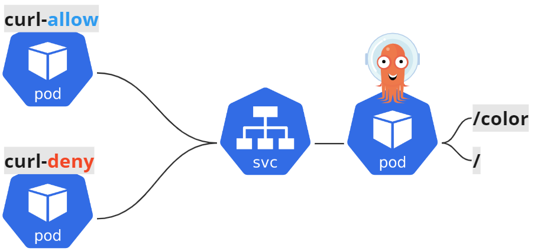
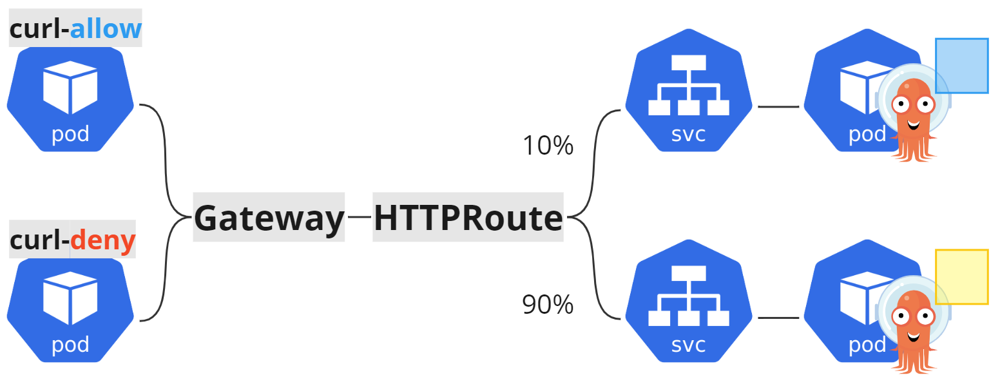
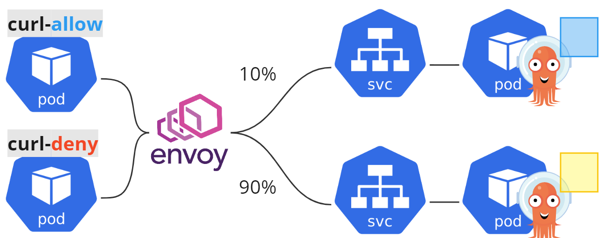

# Chapter 04d Cilium

[What is Cilium](https://cilium.io/get-started/)で説明されるように、CiliumはKubernetesクラスターやその他のクラウドネイティブ環境にネットワーキング、セキュリティ、可観測性を提供するオープンソースプロジェクトです。
Ciliumの基盤となっているのは、eBPFと呼ばれるLinuxカーネルの技術であり、セキュリティや可視性、ネットワーク制御ロジックをLinuxカーネルに動的に挿入することが可能です。

Ciliumは下記の主要コンポーネントで構成されています。
詳細については[Component Overview](https://docs.cilium.io/en/stable/overview/component-overview/#component-overview)をご参照ください。

- Agent
  - Kubernetesクラスターの各ノードで実行され、Kubernetes APIサーバーとの接続を確立し、ネットワーク及びセキュリティポリシーを維持する役割を果たします。
  - Linuxカーネルがコンテナーのネットワークアクセスを制御するために使用するeBPFプログラムの管理を行います。
- Client(CLI)
  - Cilium Agentとともにインストールされるコマンドラインツールです。
  - 同じノード上で動作するCilium AgentのREST APIと対話を行うことができ、Agentの状態やステータスの検査ができます。
  - Cliumのインストールや管理。トラブルシュートなどに使用されるCLIとは別物になります。
- Operator
  - クラスター全体の管理を行います。
  - 一時的に利用できなくてもクラスターは機能し続けますが、IPアドレス管理の遅延やAgentの再起動につながるkvstoreの不調の原因となります。
- CNI Plugin
  - PodがNode上でスケジュールまたは終了される時にKubernetesによって呼び出されます
  - Cilium APIと対話し、Networking、ロードバランシング、ネットワークポリシーを提供するために必要な設定を起動します。

```console
$ # AgentはDaemonsetリソース、OperatorはDeploymentリソースとしてデプロイされます
$ kubectl get -n kube-system -l app.kubernetes.io/part-of=cilium ds,deploy
NAME                    DESIRED   CURRENT   READY   UP-TO-DATE   AVAILABLE   NODE SELECTOR            AGE
daemonset.apps/cilium   3         3         3       3            3           kubernetes.io/os=linux   11m

NAME                              READY   UP-TO-DATE   AVAILABLE   AGE
deployment.apps/cilium-operator   2/2     2            2           11m
```

この章ではCiliumの機能として下記について説明します

- NetworkPolicy
- トラフィック制御
  - Ingress
  - Gateway API
- Service Mesh

> **Info**  
> 他の主要な機能としてObservabilityがありますが、こちらについては[Chapter5d Hubble](./../chapter05d_hubble/)にて説明します。

## Network Policy

Ciliumでは3種類のリソースでネットワークポリシーを定義できます。
詳細は[Network Policy](https://docs.cilium.io/en/stable/network/kubernetes/policy/#network-policy)を参照してください。

- NetworkPolicy
  - PodのIngress/Egressに対しL3/L4のポリシーを定義することが可能です。
  - 詳細は[Network Policies](https://kubernetes.io/docs/concepts/services-networking/network-policies/)を参照してください。
- CiliumNetworkPolicy
  - NetworkPolicyリソースとよく似ていますが、NetworkPolicyと異なりL7のポリシーを定義することが可能です
- CiliumClusterwideNetworkPolicy
  - クラスター全体のポリシーを設定するためのリソースです
  - CiliumNetworkPolicyと同じ設定が可能ですが、CiliumNetworkPolicyと異なり名前空間の指定はありません

この節では`CiliumNetworkPolicy`の動作確認を行います。

まず動作確認用のアプリケーションをデプロイします。

```sh
kubectl apply -Rf manifest/app
```

次にアプリケーションに接続するためのクライアントを2種類デプロイします。

```sh
kubectl run curl-allow -n handson-cilium --image=curlimages/curl --labels="app=curl-allow" --command -- sleep infinity
kubectl run curl-deny  -n handson-cilium --image=curlimages/curl --labels="app=curl-deny"  --command -- sleep infinity
```

下記図のような構成になります。




現状は`curl-allow`/`curl-deny`の両方から`/`と`/color`にアクセスするとすべてHTTPステータスコードが200となっていることを確認します。

```sh
kubectl exec -n handson-cilium curl-allow -- /bin/sh -c "echo -n 'curl-allow: ';curl -s -o /dev/null handson:80 -w '%{http_code}\n'"
kubectl exec -n handson-cilium curl-deny  -- /bin/sh -c "echo -n 'curl-deny:  ';curl -s -o /dev/null handson:80 -w '%{http_code}\n'"
kubectl exec -n handson-cilium curl-allow -- /bin/sh -c "echo -n 'curl-allow:color: ';curl -s -o /dev/null handson:80/color -w '%{http_code}\n'"
kubectl exec -n handson-cilium curl-deny  -- /bin/sh -c "echo -n 'curl-deny:color:  ';curl -s -o /dev/null handson:80/color -w '%{http_code}\n'"
```

動作確認として下記のような設定の`CiliumNetworkPolicy`をデプロイしてみます。
- `/`へは`curl-allow`からのみアクセス可能
- `/color`へは`curl-allow`と`curl-deny`の両方からアクセスが可能

```sh
kubectl apply -f manifest/cnp_ch4d-1.yaml
```

実際にアクセスし確認すると、想定通りの動作になっていることが分かります。

```sh
kubectl exec -n handson curl-allow -- /bin/sh -c "echo -n 'curl-allow: ';curl -s -o /dev/null handson:80 -w '%{http_code}\n'"
kubectl exec -n handson curl-deny  -- /bin/sh -c "echo -n 'curl-deny:  ';curl -s -o /dev/null handson:80 -w '%{http_code}\n'"
kubectl exec -n handson curl-allow -- /bin/sh -c "echo -n 'curl-allow:color: ';curl -s -o /dev/null handson:80/color -w '%{http_code}\n'"
kubectl exec -n handson curl-deny  -- /bin/sh -c "echo -n 'curl-deny:color:  ';curl -s -o /dev/null handson:80/color -w '%{http_code}\n'"
```

下記のように、`/`にアクセスしたcurl-denyのみHTTPステータスコード403が返ってくることを確認します。

```console
curl-allow: 200
curl-deny:  403
curl-allow:color: 200
curl-deny:color:  200
```

次節へ行く前に、作成したCiliumNetworkPolicyを削除しておきます。

```sh
kubectl delete -f manifest/cnp_ch4d-1.yaml
```

## Ingress

[Kubernetes Ingress Support](https://docs.cilium.io/en/stable/network/servicemesh/ingress/)に記載があるように、CiliumはIngressのサポートをしています。
第1章でNginx Controllerをデプロイしましたが、Nginx Controllerを使わずともCilium単体でIngressリソースを利用できます。
この節では、IngressClassとしてCiliumを利用したトラフィックルーティングを行います。

まずingressControllerを有効にします。

```bash
helmfile apply -f helmfile
```

`ingressClassName`フィールドに`cilium`を設定したIngressをアプライすればIngressリソースを利用できます。

```bash
kubectl apply -f ingress.yaml
```

```bash
curl hubble.cilium.example.com
```

## Gateway API

CiliumはGatweay APIをサポートしており、Gatway APIを利用することで、トラフィックの分割、ヘッダー変更、URLの書き換えなどのより高度なルーティング機能を利用することができるます。
Gateway APIの詳細は[Kubernetes Gateway API](https://gateway-api.sigs.k8s.io/)を参照ください。
この節ではGateway APIを利用したトラフックの分割を行います。

まず、Gateway APIのCRDをデプロイします。

```sh
kubectl apply -f https://raw.githubusercontent.com/kubernetes-sigs/gateway-api/v0.7.0/config/crd/standard/gateway.networking.k8s.io_gatewayclasses.yaml
kubectl apply -f https://raw.githubusercontent.com/kubernetes-sigs/gateway-api/v0.7.0/config/crd/standard/gateway.networking.k8s.io_gateways.yaml
kubectl apply -f https://raw.githubusercontent.com/kubernetes-sigs/gateway-api/v0.7.0/config/crd/standard/gateway.networking.k8s.io_httproutes.yaml
kubectl apply -f https://raw.githubusercontent.com/kubernetes-sigs/gateway-api/v0.7.0/config/crd/standard/gateway.networking.k8s.io_referencegrants.yaml
kubectl apply -f https://raw.githubusercontent.com/kubernetes-sigs/gateway-api/v0.7.0/config/crd/experimental/gateway.networking.k8s.io_tlsroutes.yaml
```

今回は下記のようにトラフィックを50:50に分割します。



```sh
kubectl apply -n handson -f manifestgatewayt_ch4d-2.yaml
```

LBのIPアドレスを取得します。

```sh
LB_IP=$(kubectl get -n handson svc -l io.cilium.gateway/owning-gateway=cilium-gw -o=jsonpath='{.items[0].status.loadBalancer.ingress[0].ip}')
```

10回ほど確認しおおよそ50:50に分散していることを確認します

```sh
for in in {1..10}; do \
curl ${LB_IP}/color;echo
done
```

> **Info**
> 今回のようなルーティング機能はCilium Service Meshの機能を利用しても提供することができます。
> Cilium Service Meshを利用したトラフィック分割のデモを後述します。

## L7-Aware Traffic Management

次にL7-Aware Traffic Managementについて説明します。

Ciliumでは、CRDとして定義された`CiliumEnvoyConfig`と`CiliumCllusterwideEnvoyConfig`を利用してL7トラフィックの制御を行います。
この機能を利用するためには、`type:NodePort`の有効化またはkube-proxyの置き換えが必要になります。
詳細は[L7-Aware Traffic Management#Prerequisites](https://docs.cilium.io/en/latest/network/servicemesh/l7-traffic-management/)を参照してください。

Ciliumでは、Envoy API v3をサポートしており、Envoy Extension Resource Typeへの対応状況は[Envoy extensions configuration file](https://github.com/cilium/proxy/blob/main/envoy_build_config/extensions_build_config.bzl)から確認可能です。

今回は、[L7 Traffic Shifting](https://docs.cilium.io/en/latest/network/servicemesh/envoy-traffic-shifting/)で説明される`envoy.filters.http.router`を利用したトラフィックシフトを行います。

まず、アプリケーションのデプロイを行います。

```bash
kubectl apply -f https://raw.githubusercontent.com/cilium/cilium/HEAD/examples/kubernetes/servicemesh/envoy/client-helloworld.yaml
kubectl apply -f https://raw.githubusercontent.com/cilium/cilium/HEAD/examples/kubernetes/servicemesh/envoy/helloworld-service-v1-v2.yaml
```

`helloworld-v1`に90%、`helloworld-v2`に10%のトラフィックを流すように設定します。

```bash
kubectl apply -f https://raw.githubusercontent.com/cilium/cilium/HEAD/examples/kubernetes/servicemesh/envoy/helloworld-service-v1-v2.yaml
```




下記コマンドを実行すると、`helloworld-v1`に90%、`helloworld-v2`に10%のトラフィックが流れることが確認できます。

```bash
CLIENT=$(kubectl get pods -l name=client -o jsonpath='{.items[0].metadata.name}')
for i in {1..10}; do  kubectl exec -it $CLIENT -- curl  helloworld:5000/hello; done
```


