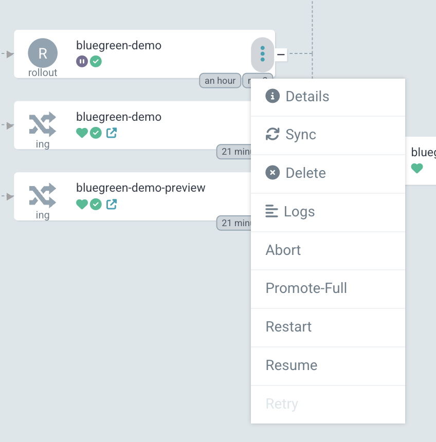
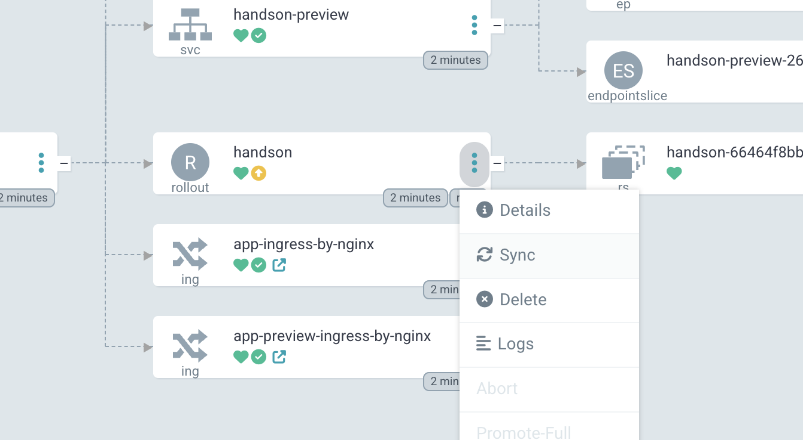
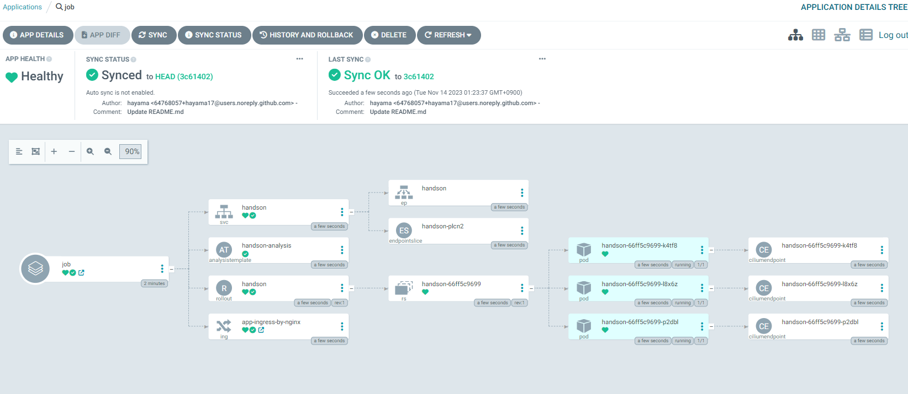
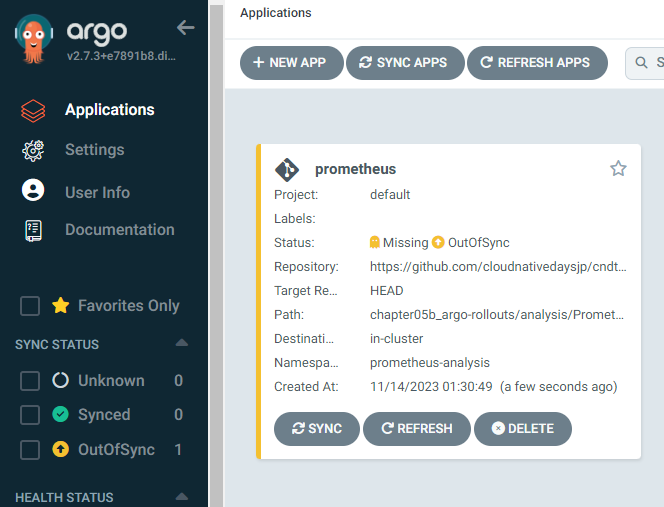
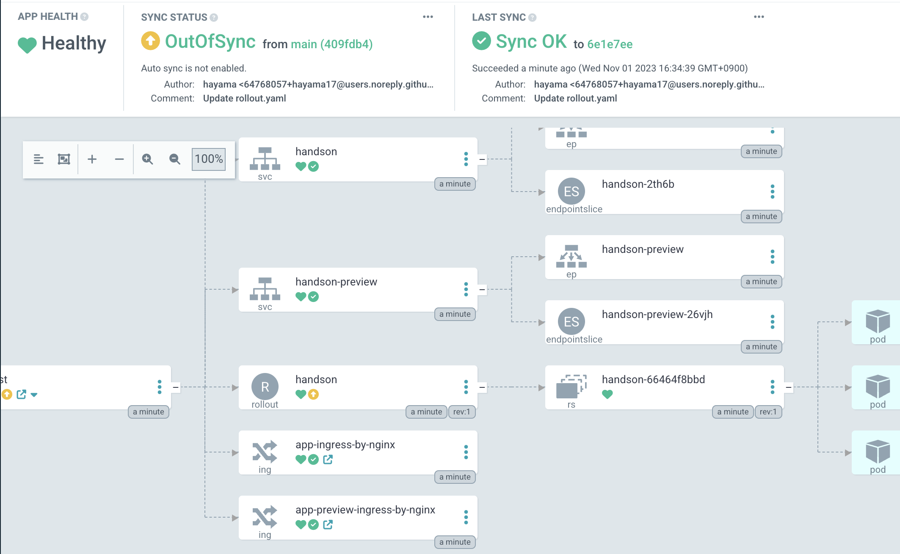

# chapter05b_argo-rollouts
この章では、Kubernetes上でプログレッシブデリバリーを可能とするデプロイツールであるArgo Rolloutsについて紹介し、導入します。

## プログレッシブデリバリーについて
プログレッシブデリバリー（Progressive Delivery）は、アプリケーションの新機能や変更を段階的に展開し、その過程を自動化してリスクを最小限に抑え、品質を確保する手法です。

実現するために、一部のユーザに対してアプリケーションを提供するトラフィック制御（カナリアリリース）、提供したアプリケーションの新機能に対する分析、分析をもとに自動化されたロールバックの三つの機能が必要になります

```mermaid
graph LR;
    カナリアリリース-->分析;
    分析-->成功;
    分析-->失敗;
    失敗-->ロールバック;
    成功-->カナリアリリース
```
  
## Argo Rolloutsについて

Argo Rolloutsは、Kubernetesコントローラおよび一連のカスタムリソース定義（CRD）で、KubernetesにBlue/Green Deployment、カナリアリリース、分析、およびプログレッシブデリバリーの機能が追加されます。


- Argo Rollouts controller
  - クラスター内のイベントを監視し、Rolloutタイプのリソースが変更されるたびに処理を行うカスタムコントローラー
  - Deploymentに代わり、Rollout resouce　に指定された状態にクラスターを持っていく処理を行っています。
- Rollout resource
  - ネイティブのKubernetes Deploymentリソースとほぼ互換性があるカスタムKubernetesリソース
  - KubernetesにBlue/Green Deployment、カナリアリリースなど高度なデプロイ方法を追加し、サポートします。
- AnalysisTemplate
  -　どのメトリクスをクエリするかを記載するテンプレート的なカスタムリソース
  - Rolloutまたはクラスター全体で定義でき、複数のRolloutで共有するためにClusterAnalysisTemplateとしても使用が可能です。
- AnalysisRun
  - 　AnalysisTemplateを元に実際に動いたjob的なカスタムリソース
 

Argo CDとの連携が可能で、簡単に既存のGit Opsにプログレッシブデリバリーができる
## セットアップ
今回のハンズオンでは、Argo CDからArgo Rolloutsを利用します。
### ローカル環境での準備
今回デプロイするWEBサービスのドメインは登録していないため、WEBサービスを利用する際にはハンズオンで利用する端末のhostsファイルを書き込む必要があります。

hostsファイルのpathはOSによって様々なので環境によって変わりますが主要なpathは以下の通りです
MacやLinuxの場合
```/etc/hosts```
Windowsの場合
```C:\Windows\System32\drivers\etc\hosts```

この章で利用するドメインは

* app.argocd.example.com
* app-preview.argocd.example.com
### Argo CDのインストール
helmファイルを利用してArgo CDをインストールします。
```
helmfile apply -f ../chapter04b_argocd/helm/helmfile.yaml
```
rollout-extensionをインストールしてArgoCD上でrolloutの操作結果が確認できるようにします。
```
kubectl apply -n argo-cd \
    -f https://raw.githubusercontent.com/argoproj-labs/rollout-extension/v0.2.1/manifests/install.yaml
```
ingressをdeployして、Argo CDのWEB UIにアクセス出来るようにします。
```
kubectl apply -f  ../chapter04b_argocd/ingress/ingress.yaml
```
### Argo Rolloutsのインストール
helmファイルを利用してArgo CDをインストールします。
```
helmfile apply -f ./helm/helmfile.yaml
```
podが作成されていることを確認します。
```
kubectl get pod -n argo-rollouts
```
## Blue GreenデプロイとCanaryリリース
Argo Rolloutsによって追加された、プログレッシブデリバリーに必要な二つのデプロイ方法を体験します。

既存のローリングアップデートでは、一部のリソースを順次更新して本番環境をアップデートするため、新バージョンと旧バージョンが混在してしまいます。

Blue Greenデプロイでは、新バージョンを事前に用意しネットワークを切り替える事で新旧両方が混在せず一気にアップデートを行う方法です。

Canaryリリースは、新旧混在状態を制御し、本番環境において限られたユーザーグループやトラフィックに対して新しいバージョンを段階的に展開するアップデート方法です。

### Blue Greenデプロイ
 Applicationsの画面において + NEW APPをクリック
上の画面上で各項目を次のように設定します。
  ```
  GENERAL
    Application Name: blue-green
    Project Name: default
    SYNC POLICY: Manual
    SYNC OPTIONS: AUTO CREATE NAMESPACE [v]
    SOURCE
      Repository URL: https://github.com/cloudnativedaysjp/cndt2023-handson
      Revision: main
      Path: chapter05b_argo-rollouts/app/blue-green
    DESTINATION
      Cluster URL: https://kubernetes.default.svc
      Namespace: blue-green
  ```
 設定できたら、CREATEをクリックします　（うまくいくと以下のようになります）
  
  
 ページ上部にある SYNC をクリックします
 無事デプロイされると以下のようになります
  

以上の手順で、Blue GreenのBlueに当たる状態がArgoCDを用いてデプロイされ、localからingressでアクセス可能となりました。

ここからは、実際にBlue Green deployを行いその様子を見ていこうと思います。

 `bluegreen-rollout.yaml`の編集を行います。
 imageのtagをblueから`green`に、変更し、差分をremoteのmasterブランチ（argocdのappを作成する際に指定したブランチ）に取り込みます。

  ```yaml
  image: argoproj/rollouts-demo:green
  ```

 ArgoCDはデフォルトでは3分に一回の頻度でブランチを確認し、差分を検出しています。
 3分待てない場合には、ページ上部にある [REFRESH]をクリックします。以下のようにbluegreen-demo rolloutにおいて差分が検出されます。（黄色で表示されているOutOfSyncが差分があることを示しています）
ちなみにAppの設定において、SYNC POLICYをManualでなくAutoにしていた場合には、ここでOutOfSyncを検知すると自動でArgoCDがSyncを実行します。

  
 rolloutを手動でSyncします
  
 syncされた結果以下のようになります。blue, green両方のreplicasetが作成されているのは、bluegreen-rollout.yamlにおいてspec.strategy.bluegreen.autoPromotionEnabledがfalseに設定されているからです
  
 それぞれのingressにアクセスすると以下のようになります。
  
 rolloutの3点リーダーをクリックし [Promte-Full]をクリックすることで、blue-green deployが行われます。プロモートが行われたどちらのingressもgreenを見るようになり、blueのreplicasetは削除されます。
  
 
 このように、ArgoRolloutのBlueGreenデプロイにおいては、一旦greenに当たるサービスが、previewServiceとして登録され、プロモートすることで、activeServiceに昇格するような動きをして、BlueGreenデプロイを実現します。  
 
 
 rollout-extensionを使用した場合、rolloutを選択しmoreのタブが出現します。moreのタブを選ぶとこのようにblueとgreenがどうなっているか一目で確認できるようになります。
  

### Canaryリリース
 Applicationsの画面において + NEW APPをクリック
 上の画面上で各項目を次のように設定します。
  ```
  GENERAL
    Application Name: canary
    Project Name: default
    SYNC POLICY: Manual
    SYNC OPTIONS: AUTO CREATE NAMESPACE [v]
    SOURCE
      Repository URL: https://github.com/cloudnativedaysjp/cndt2023-handson
      Revision: main
      Path: chapter05b_argo-rollouts/app/canary
    DESTINATION
      Cluster URL: https://kubernetes.default.svc
      Namespace: canary
  ```
 設定できたら、CREATEをクリックします　（うまくいくと以下のようになります）
  
  
 ページ上部にある SYNC をクリックします
 無事デプロイされると以下のようになります
  

以上の手順で、canaryリリースにおける安定バージョンに当たるバージョンがArgoCDを用いてデプロイされ、localからingressでアクセス可能となりました

ここからは、実際に、canaryリリースを行いその様子を見ていこうと思います。

 `rollout.yaml`の編集を行います。imageのtagをblueから`green`に、変更し、差分をremoteのmainブランチ（argocdのappを作成する際に指定したブランチ）に取り込みます

  ```yaml
  image: argoproj/rollouts-demo:green 
  ```

 ArgoCDはデフォルトでは3分に一回の頻度でブランチを確認し、差分を検出しています。3分待てない場合には、ページ上部にある [REFRESH]をクリックします。以下のようにrolloutにおいて差分が検出されます。（黄色で表示されているOutOfSyncが差分があることを示しています）
ちなみにAppの設定において、SYNC POLICYをManualでなくAutoにしていた場合には、ここでOutOfSyncを検知すると自動でArgoCDがSyncを実行します。
  
 rolloutを手動でSyncします
  
 syncされた結果以下のようになります
  
 ingressにアクセスすると以下のようになります。
ArgoRolloutのcanaryリリースにおいては、安定バージョンであるBlueから新バージョンであるGreenのタイルが少しづつ増えて行っているのが確認できます。
  
 rollout-extensionを使用した場合、rolloutを選択しmoreのタブが出現します。moreのタブを選ぶと、アプリケーションの動作を確認せずとも自動で決められたStepを動いているのが一目で確認できるようになります。
  


## Analysis Metrics
新しいリリースやバージョンを本番環境に展開する前に、新バージョンの健康状態やパフォーマンスなどを評価するために使用されます。
例えば、Blue/Green Deployの場合、Green（新バージョン）への切り替えの前にGreenのデプロイが成功しているのか一度確認したり、Canaryリリースの場合、新バージョンのパフォーマンスの分析等に利用されます。
### Metricsの種類
* Job
* Web
* Prometheus
* Datadog
* NewRelic
* Wavefront
* Kayenta
* CloudWatch
* Graphite
* InfluxDB
* Apache SkyWalking
* 独自Plugin

### 事前準備
Argo Rolloutsのメトリクスプロバイダーが、デモアプリやPrometheusにアクセスできるようにCore DNSのを設定を行う
  ```
  $ kubectl edit cm coredns -n kube-system

# Please edit the object below. Lines beginning with a '#' will be ignored,
# and an empty file will abort the edit. If an error occurs while saving this file will be
# reopened with the relevant failures.
#
apiVersion: v1
data:
  Corefile: |
    .:53 {
        errors
        health
        # 以下追加
        hosts {
           IPアドレス app.rollout.com
           IPアドレス app-preview.rollout.com
           IPアドレス prometheus.example.com
           fallthrough
        }
        # ここまで
        kubernetes cluster.local in-addr.arpa ip6.arpa {
           pods insecure
           upstream
           fallthrough in-addr.arpa ip6.arpa
        }
        prometheus :9153
        proxy . /etc/resolv.conf
        cache 30
        loop
        reload
        loadbalance
    }
kind: ConfigMap
metadata:
  name: coredns
  namespace: kube-system
  (略)

  ```
### Job metrics (Blue/Green Deploy)
アップデートする際に、jobをデプロイし、jobの実行結果によってBlue/Green DeployをPromteするかどうかを判断させるAnalysisを作成します。
  
  
Applicationsの画面において + NEW APPをクリックします

上の画面上で各項目を次のように設定します。
  ```
  GENERAL
    Application Name: job
    Project Name: default
    SYNC POLICY: Manual
    SYNC OPTIONS: AUTO CREATE NAMESPACE [v]
    SOURCE
      Repository URL: https://github.com/cloudnativedaysjp/cndt2023-handson
      Revision: main
      Path: chapter05b_argo-rollouts/analysis/job
    DESTINATION
      Cluster URL: https://kubernetes.default.svc
      Namespace: job-analysis
  ```
設定できたら、CREATEをクリックします　（うまくいくと以下のようになります）


ページ上部にある SYNC をクリックします

rollout.yamlの編集を行います。imageのtagをblueからgreenに、変更し、差分をremoteのmasterブランチ（argocdのappを作成する際に指定したブランチ）に取り込みます。
```yaml
image: argoproj/rollouts-demo:green
```
ArgoCDはデフォルトでは3分に一回の頻度でブランチを確認し、差分を検出しています。3分待てない場合には、ページ上部にある [REFRESH]をクリックします。以下のようにrolloutにおいて差分が検出されます。（黄色で表示されているOutOfSyncが差分があることを示しています）
ちなみにAppの設定において、SYNC POLICYをManualでなくAutoにしていた場合には、ここでOutOfSyncを検知すると自動でArgoCDがSyncを実行します。

rolloutを手動でSyncすると、アプリケーションのpodと新たにAnalysisrunが生成され、jobが発行されたのが確認できます。

jobが成功すると、自動的にBlue/Green Deployが進んでいくのが分かります。
### Web metrics (Blue/Green Deploy)
Analysis実行時にリクエストを送信し、レスポンスの内容にてよってPromteするかどうかを判断します
  * Json形式のレスポンスの場合Jsonの中身を見て判断します
  * Json形式以外のレスポンスの場合はstatus codeが200であるかどうかの判断になります

Applicationsの画面において + NEW APPをクリックします

上の画面上で各項目を次のように設定します。
  ```
  GENERAL
    Application Name: web
    Project Name: default
    SYNC POLICY: Manual
    SYNC OPTIONS: AUTO CREATE NAMESPACE [v]
    SOURCE
      Repository URL: https://github.com/cloudnativedaysjp/cndt2023-handson
      Revision: main
      Path: chapter05b_argo-rollouts/analysis/web
    DESTINATION
      Cluster URL: https://kubernetes.default.svc
      Namespace: web-analysis
  ```
設定できたら、CREATEをクリックします　（うまくいくと以下のようになります）


ページ上部にある SYNC をクリックします

rollout.yamlの編集を行います。imageのtagをblueからgreenに、変更し、差分をremoteのmasterブランチ（argocdのappを作成する際に指定したブランチ）に取り込みます。
```yaml
image: argoproj/rollouts-demo:green
```
ArgoCDはデフォルトでは3分に一回の頻度でブランチを確認し、差分を検出しています。3分待てない場合には、ページ上部にある [REFRESH]をクリックします。以下のようにrolloutにおいて差分が検出されます。（黄色で表示されているOutOfSyncが差分があることを示しています）
ちなみにAppの設定において、SYNC POLICYをManualでなくAutoにしていた場合には、ここでOutOfSyncを検知すると自動でArgoCDがSyncを実行します。

rolloutを手動でSyncすると、アプリケーションのpodと新たにAnalysisrunが生成されます。

Analysisrunの詳細をクリックし、Live Manifestを確認するとどういったレスポンスが帰ってきて、成功したのか失敗したのか確認できます。

正常なレスポンスが到達すると、自動的にBlue/Green Deployが進んでいくのが分かります。
### Prometheus metrics (Canary Release)
Analysis実行時にPrometheusにPromQLを送信し、その結果によってPromteするかどうかを判断します

Applicationsの画面において + NEW APPをクリックします

上の画面上で各項目を次のように設定します。
  ```
  GENERAL
    Application Name: prometheus
    Project Name: default
    SYNC POLICY: Manual
    SYNC OPTIONS: AUTO CREATE NAMESPACE [v]
    SOURCE
      Repository URL: https://github.com/cloudnativedaysjp/cndt2023-handson
      Revision: main
      Path: chapter05b_argo-rollouts/analysis/prometheus
    DESTINATION
      Cluster URL: https://kubernetes.default.svc
      Namespace: prometheus-analysis
  ```
設定できたら、CREATEをクリックします　（うまくいくと以下のようになります）


ページ上部にある SYNC をクリックします

rollout.yamlの編集を行います。imageのtagをblueからgreenに、変更し、差分をremoteのmasterブランチ（argocdのappを作成する際に指定したブランチ）に取り込みます。
```yaml
image: argoproj/rollouts-demo:green
```
ArgoCDはデフォルトでは3分に一回の頻度でブランチを確認し、差分を検出しています。3分待てない場合には、ページ上部にある [REFRESH]をクリックします。以下のようにrolloutにおいて差分が検出されます。（黄色で表示されているOutOfSyncが差分があることを示しています）
ちなみにAppの設定において、SYNC POLICYをManualでなくAutoにしていた場合には、ここでOutOfSyncを検知すると自動でArgoCDがSyncを実行します。

rolloutを手動でSyncすると、アプリケーションのpodと新たにAnalysisrunが生成されます。

Analysisrunの詳細をクリックし、Live Manifestを確認するとどういったレスポンスが帰ってきて、成功したのか失敗したのか確認できます。

Analysisrunが成功すると、自動的にCanary Releseが進んでいくのが分かります。
