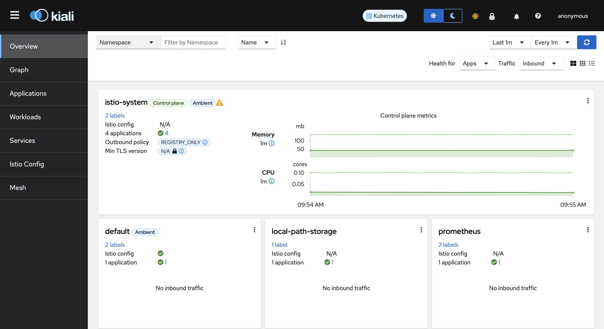
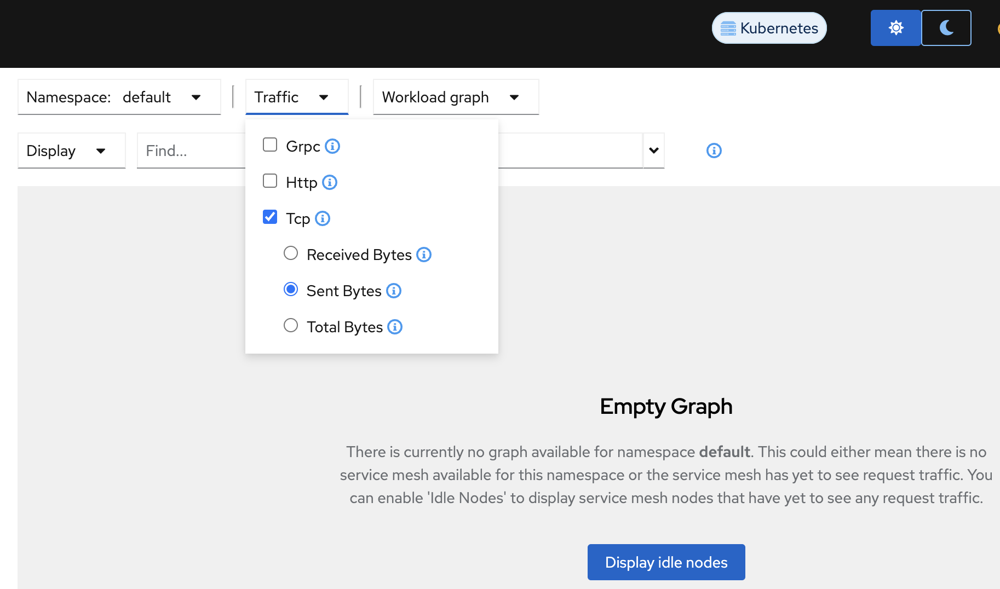
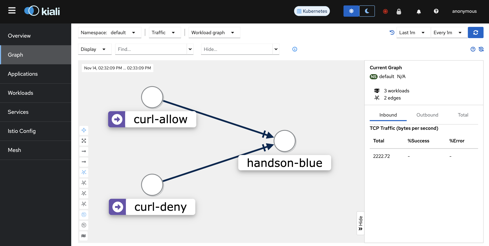
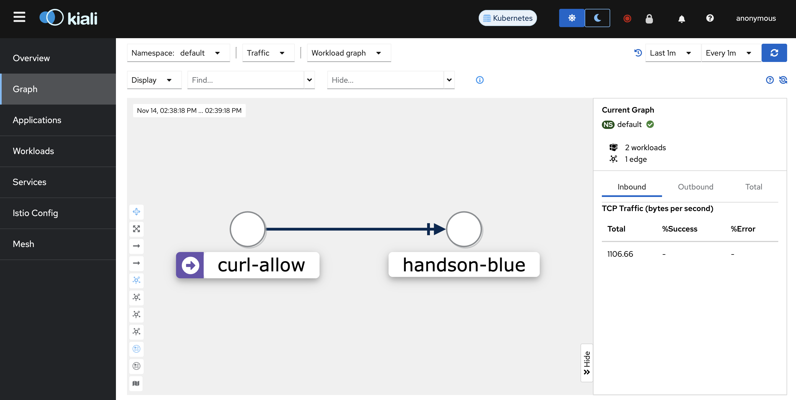
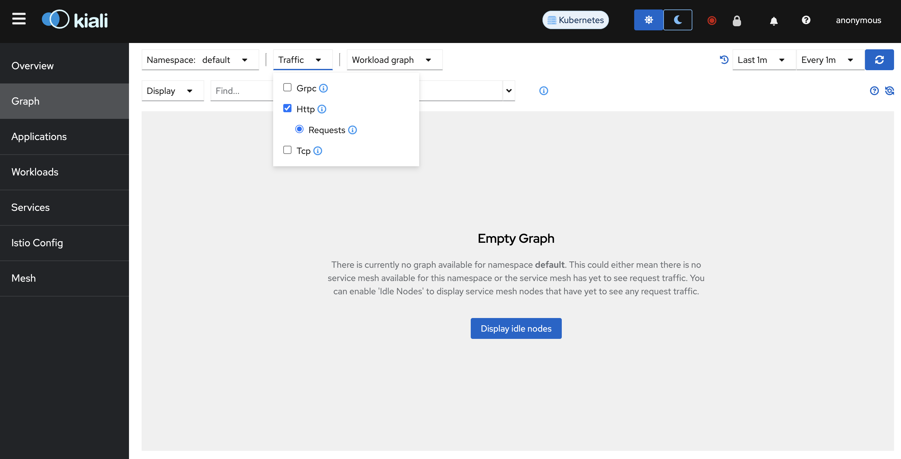
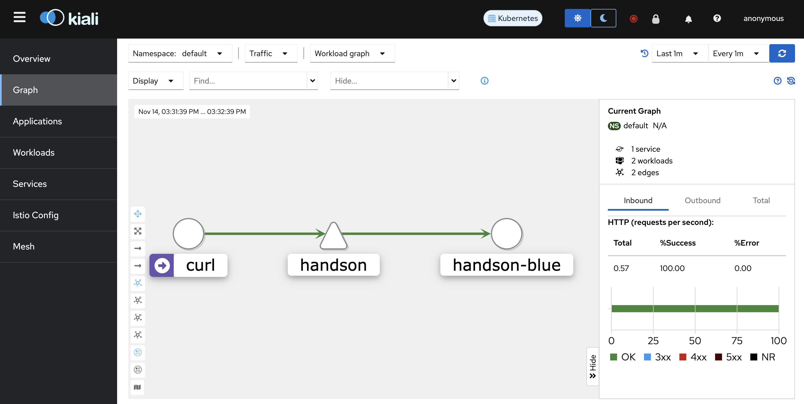
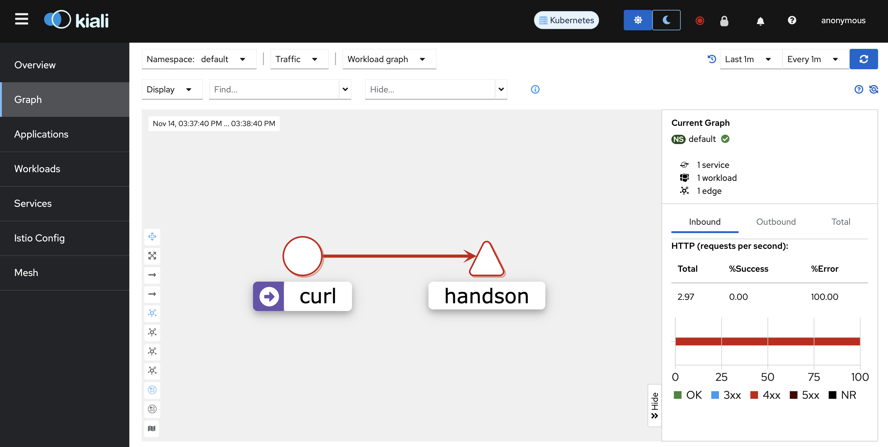

# Istio Amebient Mesh
本chapterではIstio ambient meshを使用して、サービスメッシュ内のトラフィック管理、可視化をどのように実現するのか体験します。

## 概要
### Istio ambient meshとは
2023年2月に[main branchにマージ](https://github.com/istio/istio/pull/43422)された(2023年11月現在はαステータス)、サイドカーを使用しない新しいIstioデータプレーンモードです。従来のサイドカーモードのIstioは多くの本番運用実績がありますが、データプレーンとアプリケーションの分離ができず、結果下記のような課題があげられています。

- データプレーンはサイドカーとしてアプリケーションpodに注入されるため、Istioデータプレーンのインストール、アップグレード時はpodの再起動が必要になり、アプリケーションワークロードを阻害してしまう
- データプレーンが提供する機能の選択ができないため、一部の機能(mTLS実装のみ等)しか使用しないワークロードにとっては不要なリソースをpodに確保する必要があり、全体のリソースを効率的に使用できなくなる
- HTTP準拠でないアプリケーション実装をしている場合、解析エラーや、誤ったL7プロトコルの解釈を引き起こす可能性がある

Istio ambient meshはこれらの問題を解決する目的で、Google, Solo.ioによって開発が始まりました。

### Istio ambient mesh構成
L4、L7機能の全てを管理しているサイドカーモードにおけるデータプレーンと異なり、Istio ambientモードではデータプレーンの機能を2つの層に分けて管理をします。

- Secure overlay layer


(出展元: https://istio.io/v1.16/blog/2022/introducing-ambient-mesh/)

メッシュ内ワークロード内のセキュアな通信の確立をおこなう層で、[ztunnel](https://github.com/istio/ztunnel)というコンポーネントによって管理されます。Ztunnelの主な役割は1)通信暗号のためのmTLS確立、2)L4レベルの認可、3)TCPメトリクス、ログ収集です。

ZtunnelはKubernetesクラスタ上でDaemonSetとしてデプロイされます。サイドカーモードでは、envoyが各pod内で通信のproxyをしますが、ambientモードではztunnelがメッシュ内のワークロードをnode単位でproxyします。また、node間通信(もう少し厳密に言うと、メッシュ内のサービス間通信)は、Istio 1.16リリースで公開されたHTTP/2の`CONNECT`メソッドをベースにした[HBONE](https://istio.io/latest/news/releases/1.16.x/announcing-1.16/#hbone-for-sidecars-and-ingress-experimental)(HTTP-Based Overlay Network Environment)というトンネリングを用いたmTLS接続によって行われます。

- waypoint proxy layer


(出展元: https://istio.io/v1.16/blog/2022/introducing-ambient-mesh/)

1)HTTPプロトコル、2)L7レベルの認可、3)HTTPメトリクス、ログ収集等のL7の管理をする層です。Waypoint proxyの実態はenvoyイメージを使用した[Kubernetes Gateway API](https://gateway-api.sigs.k8s.io/)のGatewayリソースが作成、管理するpodです。Ztunnelによるsecure overlay layer作成後にKubernetes namespaceごとにwaypoint proxyを作成することで、Istioが提供するL7機能を使用することができます。また、waypoint proxyはワークロード、service account単位でも作成することができます。Waypoint proxyが作成されると、ztunnelによって作成されたsecure overlay layerはトラフィックをそのwaypoint proxyにルーティングすることでL7機能が使えるようになります。

## 始める前に
- Handson用のアプリケーションがdeployされていること(まだの場合は[こちら](../chapter01.5_demo-deploy/))
- Prometheusがインストールされていること(まだの場合は[こちら](../chapter02_prometheus/))

## セットアップ
> **Important**
> Istio ambientではCNIとしてciliumを使用することが現在できません。[chapter01_cluster-create](https://github.com/cloudnativedaysjp/cndt2023-handson/tree/main/chapter01_cluster-create)でciliumベースのKubernetes clusterを作成している場合は、clusterを先に削除してから本チャプターを進めてください。

### Kubernetes cluster作成
```sh
kind create cluster --config kind/config.yaml
```

### Istio ambientのインストール
helmfileを使用してインストールをします。
```sh
helmfile sync -f helm/helmfile.d/istio-ambient.yaml
```

作成されるリソースは下記のとおりです。
```sh
kubectl -n istio-system get service,daemonset,deployment
```
```sh
# 実行結果
NAME             TYPE        CLUSTER-IP     EXTERNAL-IP   PORT(S)                                 AGE
service/istiod   ClusterIP   10.96.87.196   <none>        15010/TCP,15012/TCP,443/TCP,15014/TCP   92s

NAME                            DESIRED   CURRENT   READY   UP-TO-DATE   AVAILABLE   NODE SELECTOR            AGE
daemonset.apps/istio-cni-node   2         2         2       2            2           kubernetes.io/os=linux   72s
daemonset.apps/ztunnel          2         2         2       2            2           <none>                   72s

NAME                     READY   UP-TO-DATE   AVAILABLE   AGE
deployment.apps/istiod   1/1     1            1           92s
```

### アプリケーションのdeploy
アプリケーションpodがambientメッシュの一部になるように、deploy先のKubernetes名前空間にラベルを追加します。
```sh
kubectl label namespace default istio.io/dataplane-mode=ambient
```

Ambientメッシュ内でアプリケーションが正しく起動しているかを確認をするために疎通確認をします。Kubernetes cluster外からはアクセス出来ないため、handsonアプリケーションのKubernetes serviceをポートフォワードしてホスト側から疎通確認をします。

`sample-app` serviceをport forwardします。
```sh
kubectl port-forward service/sample-app 18080:8080 >/dev/null &
```

ホストから疎通確認をします。
```sh
curl -i http://127.0.0.1:18080/
```
HTTP status code 200、およびHTMLが無事出力されたら疎通確認完了です。もし5XXが返却された場合は、`handson-blue` ワークロードを再起動して再試行してください。
```sh
# 5XXが返却された場合。
kubectl rollout restart deploy/handson-blue
```

疎通確認完了後、Port forwardのjobを停止してください。
```sh
jobs
```
```sh
# 実行結果
[1]  + terminated  kubectl port-forward service/handson 18080:8080 > /dev/null
```
```sh
# `kubectl port-forward`を実行しているjobを停止。
kill %1
```

## Kialiのdeploy
Istioサービスメッシュ内のトラフィックを可視化するために、[Kiali](https://kiali.io/)をdeployします。KialiはIstioサービスメッシュ用のコンソールであり、Kialiが提供するダッシュボードから、サービスメッシュの構造の確認、トラフィックフローの監視、および、サービスメッシュ設定の確認、変更をすることが可能です。

helmfileを使ってKialiをインストールします。
```sh
helmfile sync -f helm/helmfile.d/kiali.yaml
```

作成されるリソースは下記の通りです。
```sh
kubectl -n istio-system get service,pod -l app=kiali
```
```sh
# 実行結果
NAME            TYPE        CLUSTER-IP     EXTERNAL-IP   PORT(S)              AGE
service/kiali   ClusterIP   10.96.123.32   <none>        20001/TCP,9090/TCP   36s

NAME                        READY   STATUS    RESTARTS   AGE
pod/kiali-8cf44fffc-h6hkw   1/1     Running   0          36s
```

外部(インターネット)からKialiにアクセスできるようにするためにIngressリソースを作成します。
```sh
kubectl apply -f ingress/kiali-ingress.yaml
```

しばらくすると、ingressリソースにIPが付与されます。
```sh
kubectl -n istio-system get ingress -l app=kiali
```
```sh
# 実行結果
NAME             CLASS   HOSTS               ADDRESS        PORTS   AGE
kiali-by-nginx   nginx   kiali.example.com   10.96.88.164   80      2m5s
```

ブラウザから`http://kiali.example.com`にアクセスをしてKialiダッシュボードが表示されることを確認してください。



## L4アクセス管理
ztunnelによって管理されるL4レベルのトラフィックに対し、Istio Authorization Policyを作成してアクセス管理を実装します。Istio ambient mesh内において、あるワークロードに対して、特定のワークロードからのL4レベルでのアクセス制御をしたい時がユースケースとして挙げられます。本ケースでは、`handson-blue`ワークロードが待ち構えているport 8080へアクセスするワークロードを2つ用意し、ひとつからは許可を、もうひとつからは拒否をするケースを想定します。

[セットアップ](#セットアップ)が完了していることを前提とします。

### Kialiグラフ設定
TCPトラフィックの状態を確認するために、TOP画面左のサイドメニューのGraphをクリックし、下記のとおり設定をしてください。
- `Namespace`の`default`にチェック


- `Traffic`の`Tcp`のみにチェック



- `Versioned app graph`から`Workload graph`に変更


### 追加アプリケーションdeploy
`sample-app`ワークロードにアクセスする追加のワークロードを2つdeployします。
```sh
kubectl apply -f app/curl-allow.yaml,app/curl-deny.yaml
```

作成されるリソースは下記の通りです。
```sh
kubectl get po -l content=layer4-authz
```
```sh
# 実行結果
NAME         READY   STATUS    RESTARTS   AGE
curl-allow   1/1     Running   0          46s
curl-deny    1/1     Running   0          46s
```

それでは双方のpodから`sample-app` ワークロードに対してリクエストをします。
```sh
while :; do
kubectl exec curl-allow -- /bin/sh -c "echo -n 'curl-allow: ';curl -s -o /dev/null handson:8080 -w '%{http_code}\n'";
kubectl exec curl-deny -- /bin/sh -c "echo -n 'curl-deny:  ';curl -s -o /dev/null handson:8080 -w '%{http_code}\n'";
echo ----------------;sleep 1;
done
```

双方のワークロードからのリクエストが成功していることが分かります。
```sh
# 出力結果
curl-allow: 200
curl-deny:  200
----------------
curl-allow: 200
curl-deny:  200
----------------
curl-allow: 200
curl-deny:  200
----------------
.
.
.
```

Kiali dashboardからも確認してみましょう。リクエストを流した状態でブラウザから`http://kiali.example.com`にアクセスをしてください。`curl-allow`, `curl-deny` podのワークロードが`handson-blue`ワークロードにアクセス出来ていることが確認できます(紺色の矢印はTCP通信を表しています)。グラフが表示されない場合は、Kialiダッシュボード右上の青い`Refresh`ボタンを押して状態を更新してください。



リクエストを一旦停止してください。

### Istio Authorization Policy適用
それでは、Istio Authorization Policyを作成して、`curl-deny` ワークロードからのport 8080宛のリクエストを拒否する設定を追加します。
```sh
kubectl apply -f networking/L4-authorization-policy.yaml
```

作成されるリソースは下記の通りです。
```sh
kubectl get authorizationpolicy -l content=layer4-authz
```
```sh
# 実行結果
NAME           AGE
layer4-authz   20s
```

再度リクエストをします。
```sh
while :; do
kubectl exec curl-allow -- /bin/sh -c "echo -n 'curl-allow: ';curl -s -o /dev/null -w '%{http_code}\n' handson:8080";
kubectl exec curl-deny -- /bin/sh -c "echo -n 'curl-deny:  ';curl -s -o /dev/null -w '%{http_code}\n' handson:8080";
echo ----------------;sleep 1;
done
```

しばらくすると、`curl-deny` podからのリクエストは拒否されるようになります。
```sh
# 出力結果例
curl-allow: 200
curl-deny:  200
----------------
curl-allow: 200
curl-deny:  200
----------------
curl-allow: 200
curl-deny:  200
----------------
curl-allow: 200
curl-deny:  000
command terminated with exit code 56
----------------
curl-allow: 200
curl-deny:  000
command terminated with exit code 56
----------------
curl-allow: 200
curl-deny:  000
command terminated with exit code 56
----------------
.
.
.
```
Http code`000`はレスポンスが何もなかったという意味で、`command terminated with exit code 56`はcurlがデータを何も受け取らなかった(コネクションがリセットされた)ということを意味しています。(参考: [curl man page/"Exit Codes"の56](https://curl.se/docs/manpage.html))。

改めてKiali dashboardから確認してみましょう。ブラウザから`http://kiali.example.com`にアクセスをしてください。しばらくすると、`curl-allow` podからのリクエストのみグラフに表示されるようになります。これは`curl-deny` podからのport 8080のリクエストをztunnelがAuthorization Poliyの設定に基づいて`handson-blue`ワークロードへのproxyを拒否しているためです。



リクエストを停止し、次は`curl-deny` podのみからリクエストをしてztunnelのログを見てみましょう。
```sh
for _ in $(seq 1 20); do
kubectl exec curl-deny -- /bin/sh -c "echo -n 'curl-deny:  ';curl -s -o /dev/null handson:8080 -w '%{http_code}\n'";
echo ----------------;sleep 1;
done
```

```sh
# 出力結果例
curl-deny:  000
command terminated with exit code 56
----------------
curl-deny:  000
command terminated with exit code 56
----------------
curl-deny:  000
command terminated with exit code 56
----------------
.
.
.
```

ztunnelのcontainer logを確認します。
```sh
ZTUNNEL_POD=$(kubectl get pod -n istio-system -l app=ztunnel --field-selector=spec.nodeName=istio-ambient-worker -o=jsonpath={.items..metadata.name})

kubectl logs -n istio-system "$ZTUNNEL_POD"
```
```sh
# 実行結果 (1行が長いためtimestampは表示は省略しています)
INFO outbound{id=032d82f8befe58dde9685d40e6b72e73}: ztunnel::proxy::outbound: proxying to 10.244.1.5:8080 using node local fast path
INFO outbound{id=032d82f8befe58dde9685d40e6b72e73}: ztunnel::proxy::outbound: RBAC rejected conn=10.244.1.15(spiffe://cluster.local/ns/default/sa/curl-deny)->10.244.1.5:8080
WARN outbound{id=032d82f8befe58dde9685d40e6b72e73}: ztunnel::proxy::outbound: failed dur=120.708µs err=http status: 401 Unauthorized
INFO outbound{id=46d9973a4305606ad145d7556f49dc14}: ztunnel::proxy::outbound: proxying to 10.244.1.5:8080 using node local fast path
INFO outbound{id=46d9973a4305606ad145d7556f49dc14}: ztunnel::proxy::outbound: RBAC rejected conn=10.244.1.15(spiffe://cluster.local/ns/default/sa/curl-deny)->10.244.1.5:8080
WARN outbound{id=46d9973a4305606ad145d7556f49dc14}: ztunnel::proxy::outbound: failed dur=134.708µs err=http status: 401 Unauthorized
.
.
.
```

`curl-deny` pod(IP: 10.244.1.15)から`handson-blue` pod(IP: 10.244.1.5)のport 8080へのアクセスはztunnelによって拒否されて、TCPセグメントは`handson-blue`ワークロードに到達していないことが分かります。

ztunnelが管理するIstio ambient mesh内のL4レベルのトラフィックにおいて、Istio Authorization Policyを使用してアクセス管理を実装しました。Istioの機能を使うことで、アプリケーション側にロジックを追加することなくL4レベルのアクセス管理を実現することができます。

### クリーンアップ
```sh
kubectl delete -f networking/L4-authorization-policy.yaml
kubectl delete -f app/curl-allow.yaml,app/curl-deny.yaml
```

## L7アクセス管理
waypoint proxyによって管理されるL7レベルのトラフィックに対し、Istio Authorization Policyを作成してアクセス管理を実装します。Istio ambient mesh内において、あるワークロードに対して、特定のワークロードからのL7レベルでのアクセス制御をしたい時がユースケースとして挙げられます。本ケースでは`handson-blue`ワークロードにアクセスをするワークロードを1つ用意し、GETメソッドのみ許可するケースを想定します。

[セットアップ](#セットアップ)が完了していることを前提とします。

### Kialiグラフ設定
HTTPトラフィックの状態を確認するために、TOP画面左のサイドメニューのGraphをクリックし、下記のとおり設定してください。
- `Namespace`の`default`にチェック


- `Traffic`の`Http`のみにチェック



- `Versioned app graph`から`Workload graph`に変更


### Waypoint proxyのdeploy
Waypoint proxyを有効にするには[Kubernetes Gateway API](https://github.com/kubernetes-sigs/gateway-api)(本項では説明は省略)の`gateway`リソースが必要になるため、まずはKubernetes Gateway CRDをインストールします。
```sh
kubectl apply -f https://github.com/kubernetes-sigs/gateway-api/releases/download/v1.0.0/standard-install.yaml
```

Kubernetes Gateway APIの`gateway`リソースを作成して、waypoint proxyを有効にします。
```sh
kubectl apply -f networking/k8s-gateway.yaml
```

作成されるリソースは下記の通りです。
```sh
kubectl get pod,gateway -l app.kubernetes.io/component=waypoint-proxy
```
```sh
# 実行結果
NAME                                          READY   STATUS    RESTARTS   AGE
pod/handson-istio-waypoint-575c848cc7-9znj9   1/1     Running   0          99s

NAME                                        CLASS            ADDRESS                                            PROGRAMMED   AGE
gateway.gateway.networking.k8s.io/handson   istio-waypoint   handson-istio-waypoint.default.svc.cluster.local   True         99s
```

### 追加アプリケーションdeploy
`handson-blue`ワークロードにアクセスするpodをdeployします。
```sh
kubectl apply -f app/curl.yaml
```

作成されるリソースは下記の通りです。
```sh
kubectl get po -l content=layer7-authz
```
```sh
# 実行結果
NAME   READY   STATUS    RESTARTS   AGE
curl   1/1     Running   0          15s
```

それでは、`curl` podから`sample-app`ワークロードに対してリクエストをします。
```sh
while :; do kubectl exec curl -- curl -s -o /dev/null handson:8080 -w '%{http_code}\n';sleep 1;done
```

リクエストは成功していることを確認してください。
```sh
# 出力結果
200
200
200
.
.
.
```

Kiali dashboardからも確認してみましょう。リクエストを流した状態でブラウザから`http://kiali.example.com`にアクセスをしてください。`curl` podから`sample-app`ワークロードにアクセス出来ていることが確認できます。下記図のようになっていない場合は、ブラウザを数回リロードしてください。



ここで`handson-blue`ワークロードへのリクエストは一旦停止してください。

### Istio Authorization Policy適用
それでは、Istio Authorization Policyを適用して、`curl` ワークロードからのGETリクエストのみを許可し、それ以外は拒否します。
```sh
kubectl apply -f networking/L7-authorization-policy.yaml
```

作成されたリソースは下記の通りです。
```sh
kubectl get authorizationpolicy -l content=layer7-authz
```
```sh
# 実行結果
NAME           AGE
layer7-authz   2m24s
```

まずは確認のためにGETリクエストをします。
```sh
while :; do kubectl exec curl -- curl -s -o /dev/null -w '%{http_code}\n' handson:8080;sleep 1;done
```

先ほどと同じく、リクエストが成功していることを確認してください。
```sh
# 出力結果
200
200
200
.
.
.
```

リクエストを一旦停止してください。

それでは、POSTメソッドでリクエストをしてみましょう。`handson-blue`ワークロードにPOSTメソッドは実装されていないので、空データを使用します。
```sh
while :; do kubectl exec curl -- curl -X POST -s -o /dev/null -d '{}' -w '%{http_code}\n' handson:8080;sleep 1;done
```

しばらくすると、403にて拒否されるようになります。
```sh
# 出力結果例
200
200
403
403
403
.
.
.
```

改めてKiali dashboardから確認してみましょう。ブラウザから`http://kiali.example.com`にアクセスをしてください。しばらくすると、`curl` ワークロードからのPOSTリクエストは拒否されていることが確認できます。



確認ができたらリクエストを停止してください。

ここで、ztunnelとwaypoint proxyがどのような動きをしたのかログで確認してみましょう。まずは、ztunnelのログを見てみます。
```sh
# 実行結果 (1行が長いためtimestampは表示は省略しています)
INFO outbound{id=0c2180533d65d4ca5c314014e5a0f806}: ztunnel::proxy::outbound: proxy to 10.96.157.249:8080 using HBONE via 10.244.1.19:15008 type ToServerWaypoint
INFO outbound{id=0c2180533d65d4ca5c314014e5a0f806}: ztunnel::proxy::outbound: complete dur=1.690584ms
INFO outbound{id=b613b5bf5d8649a7c8bd39edbeb78812}: ztunnel::proxy::outbound: proxy to 10.96.157.249:8080 using HBONE via 10.244.1.19:15008 type ToServerWaypoint
INFO outbound{id=b613b5bf5d8649a7c8bd39edbeb78812}: ztunnel::proxy::outbound: complete dur=1.714792ms
.
.
.
```
HBONEトネリングを使用して、waypoint proxy pod(ID: 10.244.1.19)を経由して`handson` Kubernetes service(IP: 10.96.157.249)にトラッフィックを流していることがわかります。次は、waypoint proxyのログを確認します。
```sh
kubectl logs -l app.kubernetes.io/component=waypoint-proxy
```
```json
# 実行結果 (見やすいようにjqで成形しています。)
{
  "upstream_service_time": null,
  "response_code": 403,
  "downstream_local_address": "10.96.157.249:8080",
  "authority": "handson:8080",
  "method": "POST",
  "upstream_transport_failure_reason": null,
  "route_name": null,
  "bytes_sent": 19,
  "upstream_host": null,
  "requested_server_name": null,
  "bytes_received": 0,
  "x_forwarded_for": null,
  "upstream_cluster": "inbound-vip|8080|http|handson.default.svc.cluster.local",
  "user_agent": "curl/8.4.0",
  "upstream_local_address": null,
  "response_code_details": "rbac_access_denied_matched_policy[none]",
  "downstream_remote_address": "envoy://internal_client_address/",
  "connection_termination_details": null,
  "protocol": "HTTP/1.1",
  "path": "/",
  "duration": 0,
  "response_flags": "-",
  "start_time": "2023-11-14T06:46:36.742Z",
  "request_id": "c1841a42-6822-4042-9bc7-932cb5cc6070"
}
{
  "method": "POST",
  "start_time": "2023-11-14T06:46:37.917Z",
  "bytes_sent": 19,
  "response_flags": "-",
  "upstream_local_address": null,
  "protocol": "HTTP/1.1",
  "upstream_service_time": null,
  "upstream_transport_failure_reason": null,
  "connection_termination_details": null,
  "upstream_cluster": "inbound-vip|8080|http|handson.default.svc.cluster.local",
  "downstream_remote_address": "envoy://internal_client_address/",
  "response_code_details": "rbac_access_denied_matched_policy[none]",
  "x_forwarded_for": null,
  "requested_server_name": null,
  "upstream_host": null,
  "request_id": "a4a64abf-42c8-4f0b-aa25-e72c406eb1d3",
  "bytes_received": 0,
  "downstream_local_address": "10.96.157.249:8080",
  "response_code": 403,
  "duration": 0,
  "route_name": null,
  "path": "/",
  "authority": "handson:8080",
  "user_agent": "curl/8.4.0"
}
.
.
.
```
`upstream_cluster`として`handson` Kubernetes serviceが認識されていますが、RBACのアクセス拒否によってupstreamまでリクエストが到達していないことが分かります。


Waypoint proxyが管理するIstio ambient mesh内のL7レベルのトラフィックにおいて、Istio Authorization Policyを使用してアクセス管理を実装しました。Istioの機能を使うことで、アプリケーション側にロジックを追加することなくL7レベルのアクセス管理を実現することができます。

`sample-app`ワークロードへのリクエストは忘れずに停止してください。

### クリーンアップ
```sh
kubectl delete -f networking/L7-authorization-policy.yaml,networking/k8s-gateway.yaml
kubectl delete -f app/curl.yaml
```

## まとめ
サイドカーを用いないIstioの新しいデータプレーンであるIstio ambient meshを使用することで、アプリケーションと、データプレーンの分離が可能になります。これにより、データプレーン起因によるアプリケーションワークロードの阻害を防止することができます。さらに、サイドカーを使用せずに、ztunnel, waypoint proxyを用いることにより、L4, L7管理をアプリケーションの必要に応じて実装することができるようになります。2023年11月の段階ではalphaステータスでありますが、Istio ambient meshをぜひ試してみてください。

Istio ambient meshに関するGitHub Issue: https://github.com/istio/istio/labels/area%2Fambient

## クリーンアップ
Kubernetes clusterを削除します。
```sh
kind delete cluster --name istio-ambient
```
