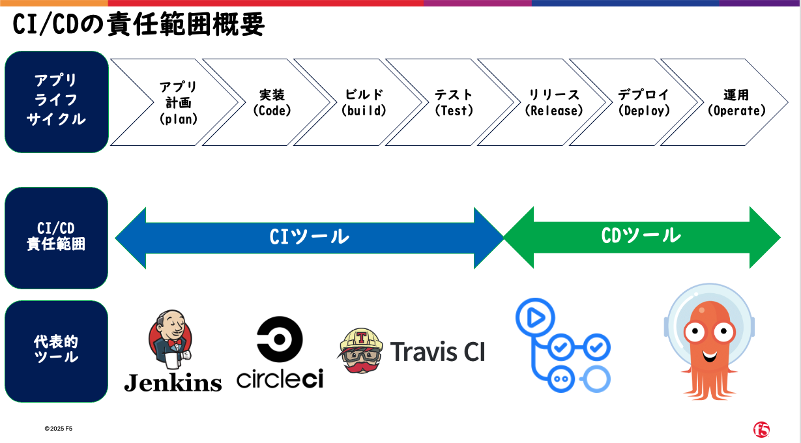

# CI/CD

## 概要
この章では、CI/CDについて理解し、現在のCloud Nativeの実環境でなぜ利用されているか、そしてなぜ必要かを説明します。
現在、Continuous Delivery Fundation (https://cd.foundation/) が設立され、CI/CDのベストプラクティスなど業界仕様をさらに推進しています。

***
### CI/CDとは  
---
CI/CDについてですが、 **CI** は、(**Continuous Integration：継続的なインテグレーション**)の略称で、  
開発者がアプリケーション開発から統合(Intergration)まで、必要なプロセスを自動化します。  
開発プロセスとして、ソースコード取得、ビルト、ソースコード取得、アプリケーションの統合、  
パッケージング、単体・結合テストなどを実施します。  

**CD**は、(**Continuous Delivery: 継続的デリバリー**)の略称で、アプリケーションのリリースまでの自動化を担います。    
また、CDとしては、(Continuous Deploy: 継続的デプロイ)として意味合いも持ちます。  
その違いの棲み分けとしては、責任範囲の違いにあります。   
継続デリバリーは、上記の通り、アプリケーションのリリースまで自動化しますが、  
ユーザが機能を利用可能な状態までにはしません。CIで作成されたアプリケーションやマニフェストなどの  
資産を自動的に本番環境に公開可能な上状態まで運びます。

継続デプロイは、デプロイまでの自動化を担い、対象ソフトウェアを本番環境にデプロイした後、  
ユーザへの公開も自動的に行います。そして、ソフトウェアの有効性をテストし、条件を満たせば  
定められたタイミングユーザ公開をし、条件を満たせなければロールバックし、デプロイ前の状態に復旧する責任を持ちます。  

---
### なぜCI/CDが必要になるのか・・・
---
アプリケーションのマイクロサービス化が主流になっている中、CI/CDはマイクロサービス・アジャイル開発が  
登場する以前から存在した概念であり、CI/CD注目度、重要度が上がってきています。    
なぜならソフトウェアデリバリプロセスに対して、人の手が都度介入しなければならないデリバリプロセスには、  
コンテナイメージビルド、バリでション、テスト、デプロイ、ローンチがあり、あらゆる局面での品質やリードタイムに  
ばらつきを産む可能性があり、その点をCI/CDを使うことにより、「徹底的な自動化」をデリバリプロセスに提供することから、   
品質を一定に保つことが可能になります。  

最近では、Cloud Native環境においては、Gitopsを利用したKubernetesへのアプリケーションデプロイが  
増えてきており、例えば、CircleCIのみでもCI/CDの提供が可能ですが、CD部分を専用としてOSSであるArgoCDと  
組み合わせた利用事例が増えています。ArgoCDが多く利用される理由としては、GUIを通して設定が可能であり、  
且つステータスの確認やSync状況などを確認できる優位性があるためです。  

<参照: クラウドネイティブで実現するマイクロサービス開発・運用 実践ガイド>

# CICDのCI部分の動作確認

[CI(Continuous Integration)のハンズオン手順](./README_CI.md)

# CICDのCD部分の動作確認

[CD(Continuous Delivery)のハンズオン手順](./README_CD.md)
