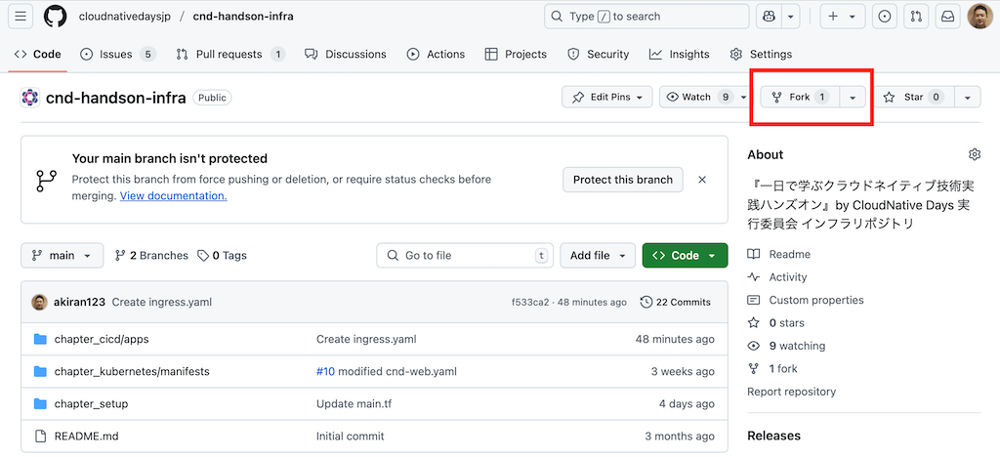
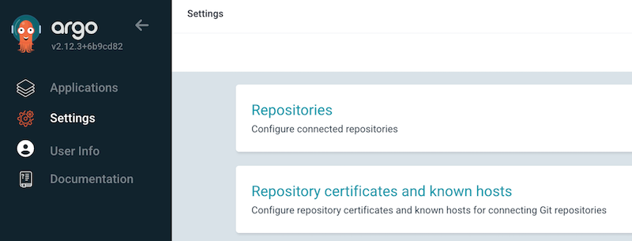
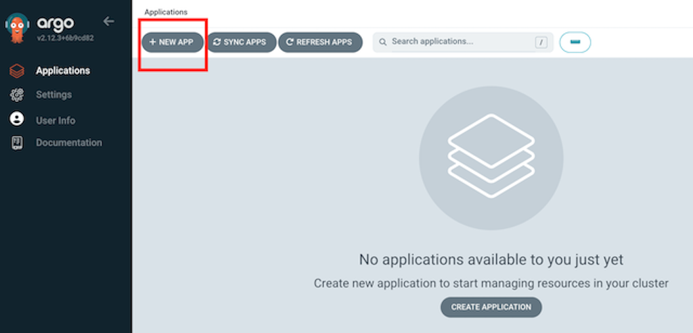
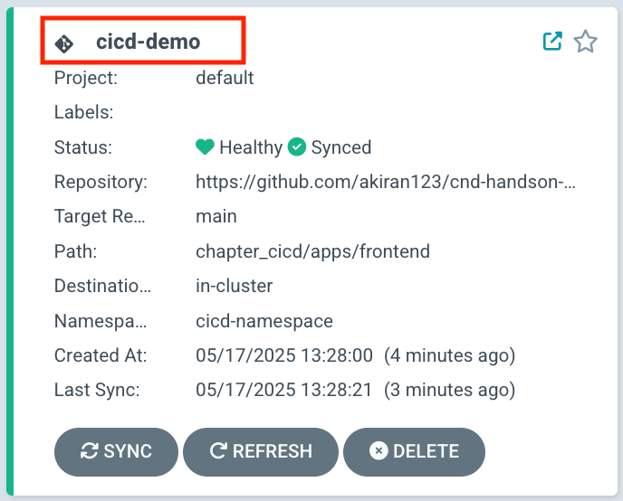
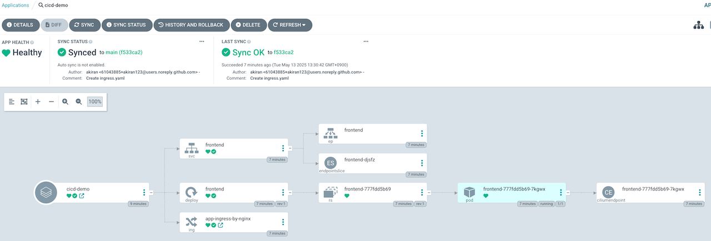
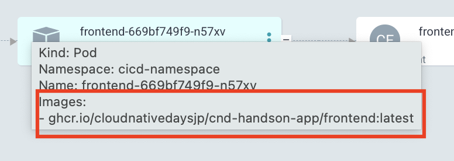
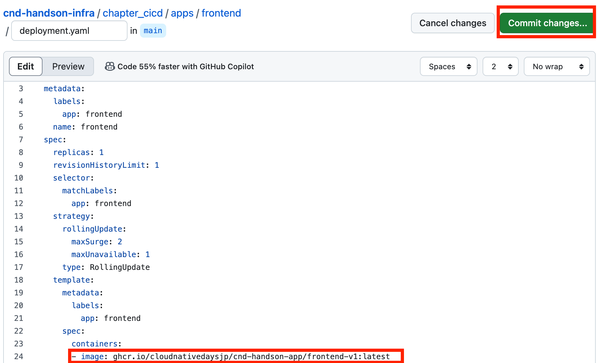
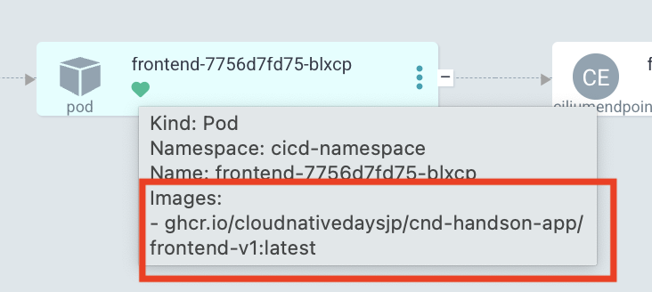

このドキュメントは、CD(Countinuous Delivery)のハンズオン資料になります。  
ハンズオンのChapter_argocdにある、ArcoCDを利用して実施していきます。  
そのため、ArgoCDをインストールしていない場合には、以下サイトからインストールを実施してください。  
ArgoCDの詳細については、[こちら](https://github.com/cloudnativedaysjp/cnd-handson/blob/main/chapter_argocd/README_webui.md)を参照ください。  

# 今回利用するリポジトリの準備  
## Gitリポジトリの準備(ローカル環境)

Argo CDを利用するため、GitHubへPush等が必要となり、それをトリガーとして利用します。  
このハンズオンのリポジトリをforkし、準備します。

[cnd-handson-infra](https://github.com/cloudnativedaysjp/cnd-handson-infra)  
↑をクリックし、forkを実施していきます。  
実際には、その中の**chapter_cicd/apps/frontend**のアプリを利用してハンズオンしていきます。

**fork**をクリックをして、Create a new forkで、名前を指定して自分のリポジトリへforkさせます。  




**create fork**をクリックします。  
自分のリポジトリを確認し、cnd-handson-infraがforkされていることを確認します。  


ここからは、Argo CDの詳細については、[ArgoCD](https://github.com/cloudnativedaysjp/cnd-handson/blob/main/chapter_argocd/README_webui.md)が動作している前提で解説していきます。  
動作していない場合には、上記リンクからインストールを実施してください。  
Argo CDのWebGUIへログインできれば問題ないです。  

## Argo CDのWebページへログイン
Argo CDのWebページへログインし、先ほどForkしたリポジトリを同期させます。  

**左のタブのSetting**をクリックし、**Repositories**をクリックします。



**CONNECT REOP**をクリックします。


以下ように自分の設定あうように設定していきます。  


```
GENERAL
Choose your connection method: VIA HTTPS
Type: git
Project: default
Repository URL: https://github.com/自身のアカウント名/cnd-handson-infra
```
最後、** + CONNECT REPO **をクリックします。  
うまく繋がると、CONNECTIOM STATUSが **Successful** になります。  

## デモアプリをArgo CD上にデプロイ（Frontendアプリの実装）
デモアプリのデプロイを行い、Argo CDの一連の操作を行います。




```
GENERAL
  Application Name: cicd-demo
  Project Name: default
  SYNC POLICY: Manual
  SYNC OPTIONS: AUTO CREATE NAMESPACE [v]
  SOURCE
    Repository URL: https://github.com/自身のアカウント名/cnd-handson-infra
    Revision: main
    Path: chapter_cicd/apps/frontend
  DESTINATION
    Cluster URL: https://kubernetes.default.svc
    Namespace: cicd-namespace
```

設定できたら、**CREATE**をクリックして、下記のように表示されていることを確認して下さい。　　


ページ上部にある**SYNC**をクリックして、無事デプロイされると下記のように表示されていることを確認して下さい。  




↑の赤枠クリックするとを詳細がみれます。
そして、**SYNCHRONIZE** をクリックしてください。  
ステータスが**HealthyとSynced**になることを確認してください。






podのimageが、` - image: ghcr.io/cloudnativedaysjp/cnd-handson-app/frontend:latest`  
になっていること。


---
## ここまででFrontendアプリがきちんと導入された状態
Frontendのページへアクセスしてみます。  
`http://app.cicd.example.com/login`  
すると以下のログイン画面がでてきます。  


※メールアドレス、パスワードは、任意で入力してください。
認証機能を今回は動かしていないため、メールアドレス/パスワードを  
適当な文字列を入力することでログインできるようにしています。  
その後、**ログイン**をクリック。

```
例
メールアドレス: a@a
パスワード: 12345
```

すると、以下の**青いバー**の画面が表示されます。  


ここまでで、Frontendのアプリケーションが動作しているところまで確認できました。
では、CDの部分の動作を確認していきます。  
今回は先ほどforkしたリポジトリを直接変更します。  


ここで、  
` - image: ghcr.io/cloudnativedaysjp/cnd-handson-app/frontend:latest`  
を  
` - image: ghcr.io/cloudnativedaysjp/cnd-handson-app/frontend-v1:latest`  
に変更し、`Commit Changes`します。  



ArgoCDの画面に戻り、この状態で既存で動いているFrontendの変更をKickします。  
**SYNC**をクリックして、**SYNCHRONIZE**をクリックします。  




podのimageが、` - image: ghcr.io/cloudnativedaysjp/cnd-handson-app/frontend:latest`  
になっていること。

この状態で、新しく**Frontend**のアプリが更新されました。  
では、Frontendのページへアクセスしてみます。  
`http://app.cicd.example.com/login`  
先ほど同様に入力し、ログインします。  
すると、以下の**黒いバー**の画面が表示されます。  


これで、Githubの設定変更をトリガーとしてアプリケーションが更新されるという、
CD部分のハンズオンが完了になります。


